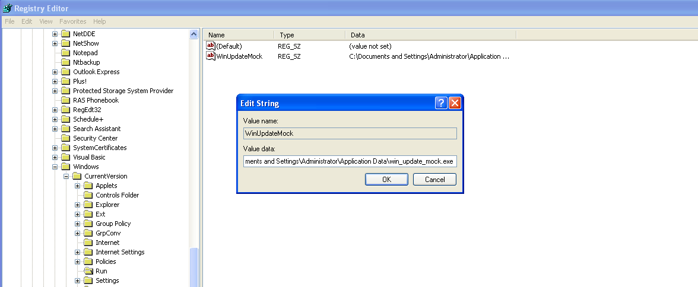

# Windows RE Analysis Lab

The **Windows RE Analysis Lab** is an educational Windows reverse engineering project created to simulate and analyze behavior patterns commonly observed in malware samples.

## Core Capabilities

- **Anti-Debugging:** Actively detects debugger presence using both standard Windows APIs (`IsDebuggerPresent`) and direct, hook-evading Process Environment Block (PEB) inspection via inline assembly (`$FS:[0x30]`).
- **Anti-VM:** Validates the execution environment by comparing network adapter MAC address prefixes against known virtualization vendors (VMware, VirtualBox), triggering a disruptive GDI screen-melting effect if a sandbox is detected.
- **Anti-Disassembly:** Uses an opaque predicate combined with a rogue junk byte (`0xE8`) to intentionally misalign instructions, demonstrating localized code desynchronization in disassemblers like IDA Pro.
- **Persistence Mechanisms:** Demonstrates autostart execution by masquerading as a Windows update executable and modifying the `HKCU\Software\Microsoft\Windows\CurrentVersion\Run` registry key.
- **Ransomware Simulation:** Safely emulates ransomware behavior by utilizing the native Windows Cryptography API (CryptoAPI) to encrypt a designated in-memory string using RC4, followed by a non-destructive visual payload (cascading ransom-style popups).
- **Embedded Fake IOCs:** Integrates a curated array of deceptive static artifacts (fake URLs, base64 strings, CVE references, and PowerShell commands) to demonstrate the pitfalls of automated string extraction during static triage.

## Preview

### Anti-Debugging Triggered


*Execution under a debugger triggers the anti-debugging branch and terminates the sample early.*

### Registry Run Key Persistence


*The sample creates a `Run` key entry to launch automatically at user logon.*

### Ransomware Simulation Triggered


*The sample simulates ransomware behavior by displaying repeated ransom-themed popups after encrypting an in-memory test string using the Windows CryptoAPI.*

## Full Technical Documentation

Detailed technique-by-technique analysis is available here:

**[docs/techniques.md](docs/techniques.md)**

## Safety & Ethics

This repository is provided for educational and defensive research purposes only.

- No compiled binaries are distributed.
- The project is presented as a controlled analysis artifact.
- The focus is on reverse engineering, documentation, and security research workflow.

## Repository Structure

```text
windows-re-analysis-lab/
├── README.md
├── LICENSE
├── src/
│   └── main.c
├── docs/
│   └── techniques.md
└── screenshots/
