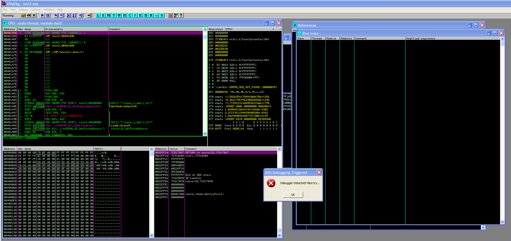
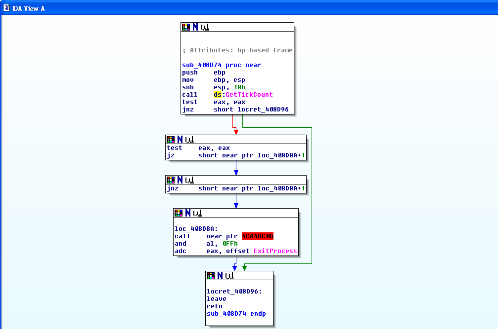

# Techniques

## Summary
- **Anti-Debugging**: Actively checks for debuggers using both standard Windows APIs and direct Process Environment Block (PEB) inspection.
- **Anti-VM**: Detects sandbox environments by comparing network adapter MAC address prefixes against known VMware and VirtualBox identifiers.
- **Anti-Disassembly**: Employs opaque predicates and junk byte insertion to disrupt static analysis and linear disassemblers.
- **Persistence Mechanisms**: Establishes reboot survival by masquerading as a Windows update executable and modifying the Registry Run key.
- **Benign Ransomware Payload**: Simulates cryptographic ransomware behavior by encrypting strings in memory using the Windows CryptoAPI and RC4 algorithm.
- **Deception Strategy**: Embeds a list of fake Indicators of Compromise (IOCs) to mislead automated string extraction tools.

---

## Anti-Debugging

**Description**: The application identifies if it is being executed within a debugger to prevent dynamic analysis.

### Screenshot: Anti-Debugging Triggered

**How it is implemented in `main.c`**  
- `main()` checks two conditions:
  - `IsDebuggerPresent()` (Windows API)
  - `CheckPEB_BeingDebugged()` (direct PEB flag inspection via inline assembly)
- If either condition is true, the program displays a mocking Top-Most MessageBox ("Debugger Detected! Nice try...") and immediately terminates, blocking further dynamic analysis.

---

## Anti-VM

**Description**: The malware checks whether it is running inside a virtual machine and diverts execution into a disruptive visual payload instead of continuing normal execution.

### Screenshot: Anti-VM Melting Screen Triggered

**How it is implemented in `main.c`**  
- `CheckVM_MAC()` calls `GetAdaptersInfo()` and iterates network adapters.
- It checks the first three bytes of each adapter MAC address against known VM prefixes:
  - VMware: `00:05:69`, `00:0C:29`, `00:50:56`
  - VirtualBox: `08:00:27`
- In `main()`, if `CheckVM_MAC()` returns `TRUE`, the program calls `MeltScreen()` (infinite GDI loop).

---

## Anti-Disassembly

**Description**: The sample includes a simple opaque predicate intended to introduce a misleading control-flow branch during static analysis.

### Screenshot: Opaque Predicate in IDA Graph View

**How it is implemented in `main.c`**
- The function calls `GetTickCount()`.
- The return value is compared to zero.
- If the value equals zero, execution jumps to a branch that calls `ExitProcess()` and contains additional instructions.
