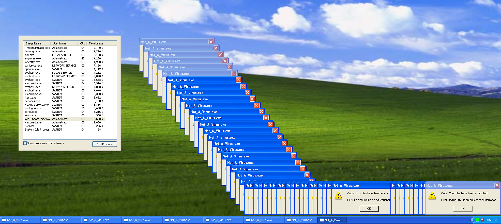

# Techniques

## Summary
- **Anti-Debugging**: Actively checks for debuggers using both standard Windows APIs and direct Process Environment Block (PEB) inspection.
- **Anti-VM**: Detects sandbox environments by comparing network adapter MAC address prefixes against known VMware and VirtualBox identifiers.
- **Anti-Disassembly**: Employs opaque predicates and junk byte insertion to disrupt static analysis and linear disassemblers.
- **Persistence Mechanisms**: Establishes reboot survival by masquerading as a Windows update executable and modifying the Registry Run key.
- **Ransomware Simulation**: Simulates cryptographic ransomware behavior by encrypting strings in memory using the Windows CryptoAPI and RC4 algorithm.
- **Embedded Fake IOCs**: Embeds a list of fake Indicators of Compromise (IOCs) to mislead automated string extraction tools.

---

## Anti-Debugging

**Description**: The sample identifies if it is being executed within a debugger to prevent dynamic analysis.

### Screenshot: Anti-Debugging Triggered

**How it is implemented in `main.c`**  
- `main()` checks two conditions:
  - `IsDebuggerPresent()` (Windows API)
  - `CheckPEB_BeingDebugged()` (direct PEB flag inspection via inline assembly)
- If either condition is true, the program displays a mocking Top-Most MessageBox ("Debugger Detected! Nice try...") and immediately terminates, blocking further dynamic analysis.

---

## Anti-VM

**Description**: The sample checks whether it is running inside a virtual machine and diverts execution into a disruptive visual payload instead of continuing normal execution.

### Screenshot: Anti-VM Melting Screen Triggered

**How it is implemented in `main.c`**  
- `CheckVM_MAC()` calls `GetAdaptersInfo()` and iterates network adapters.
- It checks the first three bytes of each adapter MAC address against known VM prefixes:
  - VMware: `00:05:69`, `00:0C:29`, `00:50:56`
  - VirtualBox: `08:00:27`
- In `main()`, if `CheckVM_MAC()` returns `TRUE`, the program calls `MeltScreen()` (infinite GDI loop).

---

## Anti-Disassembly

**Description**: The sample includes a simple opaque predicate intended to introduce a misleading control-flow branch during static analysis.

### Screenshot: Opaque Predicate in IDA Graph View

**How it is implemented in `main.c`**  
- The function calls `GetTickCount()`.
- The return value is compared to zero.
- If the value equals zero, execution jumps to a branch that calls `ExitProcess()` and contains additional instructions.

---

## Persistence

**Description**: The sample establishes user-level persistence by copying itself to the user profile and creating a Registry Run entry so it launches automatically at logon.

### Screenshot: Registry Run Key Persistence

### Screenshot: Persistent Process After Logon

**How it is implemented in `main.c`**  
- `InstallPersistence()`:
  - Retrieves the current executable path with `GetModuleFileNameA()`.
  - Resolves `%APPDATA%` via `ExpandEnvironmentStringsA("%APPDATA%", ...)`.
  - Copies itself to `%APPDATA%\win_update_mock.exe` using `CopyFileA()`.
  - Creates/opens the Run key:
    - `HKCU\Software\Microsoft\Windows\CurrentVersion\Run`
  - Writes a value named `WinUpdateMock` pointing to the copied path via `RegSetValueExA()`.

 ---

 ## Ransomware Simulation

**Description**: The sample simulates ransomware-style behavior by encrypting an in-memory string using the Windows CryptoAPI and then repeatedly displaying ransom-themed message boxes.

### Screenshot: Ransomware Simulation Triggered

**How it is implemented in `main.c`**  
- `ExecuteBenignPayload()`:
  - Defines an in-memory test string (`targetString[]`) and a password (`"supersecretpassword"`).
  - Uses CryptoAPI:
    - `CryptAcquireContextA()` (with `CRYPT_VERIFYCONTEXT`)
    - `CryptCreateHash()` with `CALG_MD5`
    - `CryptHashData()` over the password
    - `CryptDeriveKey()` with `CALG_RC4`
    - `CryptEncrypt()` to encrypt the in-memory string buffer
  - After encryption, it enters an infinite loop that repeatedly spawns `PopupThread` via `CreateThread()` and sleeps briefly.
- `PopupThread()` displays a message box:
  - Text: `Oops! Your files have been encrypted! ... (Just kidding, this is an educational simulation!)`
  - Title: `Not_A_Virus.exe`

---
